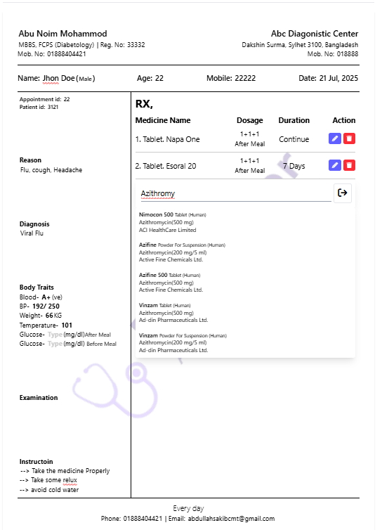
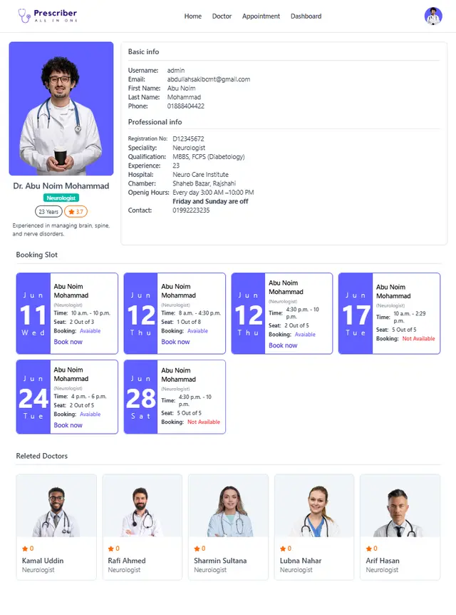
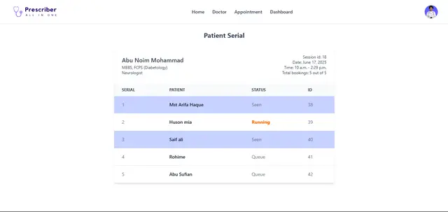
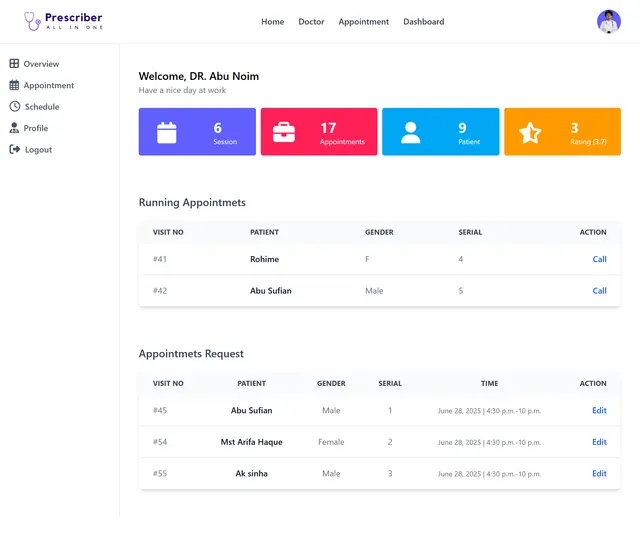

# 🩺 Prescriber – Online Doctor Appointment & Prescription System

Prescriber is a web-based platform for doctors and healthcare professionals to manage appointments, patients, and prescriptions. Built using Django and Tailwind CSS, it offers a seamless and modern experience for clinics and individual practitioners.

---

[Live Link](https://prescriber.pythonanywhere.com/)
[My Portfolio](https://prescriber.pythonanywhere.com/)

---

## 🚀 Features

- ✅ Doctor authentication & profile
- ✅ Patient management
- ✅ Online appointment booking
- ✅ Serial scheduling and session handling
- ✅ Prescription creation & PDF generation
- ✅ Admin dashboard
- ✅ Responsive UI with Tailwind CSS
- ✅ Modal-based detailed views (scroll lock supported)
- ✅ Secure, scalable, and extendable

---

## 🛠️ Tech Stack

- **Backend:** Django (Python)
- **Frontend:** Django Template, Tailwind CSS, Vanila Javascript
- **Database:** SQLite  
- **Authentication:** Django built-in auth
- **Deployment:** PythonAnywhere

---
## Screenshots
---









## 📦 Installation

```bash
# Clone the repo
git clone https://github.com/abdullah-124/prescriber.git
cd prescriber

# Create virtual environment
python -m venv venv
source venv/bin/activate  # On Windows: venv\Scripts\activate

# Install dependencies
pip install -r requirements.txt

# Migrate database
python manage.py migrate

# Create superuser
python manage.py createsuperuser

# Run development server
python manage.py runserver
